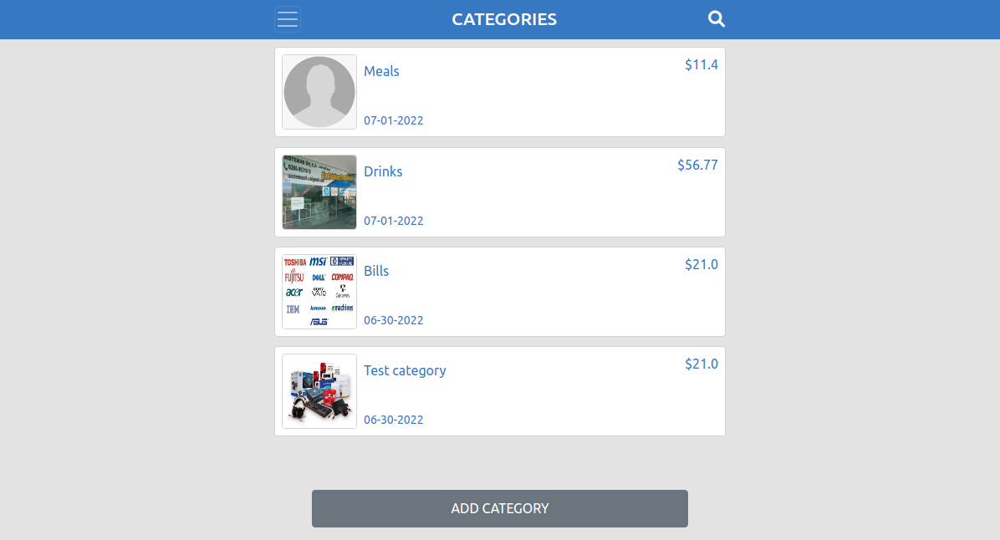

# Budget App

> A Ruby on Rails app for managing personal budget and generating transactions with categories.



The BudgetApp keeps track of all your transactions and trades. This app will allow you to create categories, keep track of your budget, create transactions, and visualize your expenses. You can create an account and log in to any device.

## Built With

- Ruby 3.1.2
- Ruby on Rails 7.0.3
- PostgreSQL 14.4
- Devise 4.8.1
- Hotwire Turbo/Stimulus
- Sass
- Bootstrap

## Live Demo

[Click Here](https://budget-app-helio.herokuapp.com/)

## Getting Started

To get a local copy up and running follow these simple steps.

### Prerequisites

- Have git correctly installed.
- Have Ruby correctly installed.
- Have Rails correctly installed.
- Have PostgreSQL correctly installed.

### Setup

- Open a terminal window where you want to have installed a clone of the repository.

### Install

- Use this command to clone the repo:
```
$ git clone git@github.com:helio3197/budget-app.git
```
- Install the required dependencies:
```
$ bundle install
```
- Create database and load schema:
```
$ rails db:setup
```
### Usage

- Run:
```
$ rails s
```

- Tests:
```
$ rspec
```

- Edit the content as you like.


## Authors

👤 **Kenny Salazar**

- GitHub: [@helio3197](https://github.com/helio3197)
- Twitter: [@kennysalazar31](https://twitter.com/kennysalazar31)
- LinkedIn: [LinkedIn](https://linkedin.com/in/kenny-salazar-1a1687110)


## 🤝 Contributing

Contributions, issues, and feature requests are welcome!

Feel free to check the [issues page](../../issues/).

## Show your support

Give a ⭐️ if you like this project!

## Acknowledgments

- Thanks to Microverse for the guidelines.


## 📝 License

This project is [MIT](./LICENSE) licensed.
